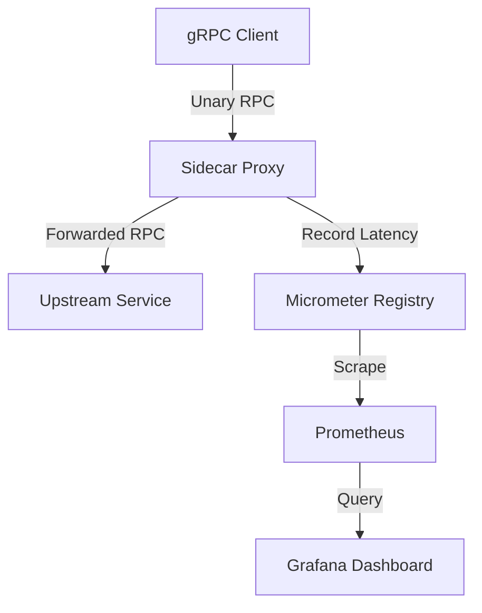

# Low-Overhead gRPC Observability Sidecar

A production-ready sidecar designed to transparently intercept and measure gRPC traffic with minimal latency penalty.

## Problem

Observing gRPC microservices typically requires embedding language-specific interceptors (Java, Go, Python). This couples observability to the application layer, requiring code changes and redeployments just to tweak metrics.

## Why observability has a cost

Every metric recorded requires CPU cycles. Naive implementations block threads, allocate memory on the hot path, or create high-cardinality label explosions that crash Prometheus. 

This sidecar uses high-performance byte-level proxying (`ServerCallHandler<byte[], byte[]>`) combined with memory-bounded `HdrHistogram` and Micrometer to ensure that tracking latency doesn't *cause* latency.

## Architecture



## Request flow

1. The client sends a gRPC request to the sidecar.
2. The sidecar extracts the full method name (e.g. `/example.payment.PaymentService/Authorize`).
3. The method name is validated against the `CardinalityController`.
4. The request payload (`byte[]`) is forwarded to the upstream without unmarshalling the protobuf.
5. `System.nanoTime()` measures the response latency.
6. The sidecar forwards the response payload and status code to the client.

## Metrics collected

- `grpc_requests_total`
- `grpc_errors_total`
- `grpc_status_total`
- `grpc_requests_in_flight`
- `grpc_request_duration_seconds` (Prometheus Histogram)
- `grpc_request_bytes`
- `grpc_response_bytes`

## Cardinality control

To protect Prometheus from label explosions (e.g., from generated or fuzzed method names), the `CardinalityController`:
- Normalizes unknown methods to `__other__`.
- Allows enforcing an explicit allowlist.
- Caps the maximum number of unique method labels tracked.

## Deadline propagation

gRPC deadlines are inherently propagated because the sidecar forwards the HTTP/2 headers unmodified to the upstream.

## Sampling strategy

Sampling can be configured to record 100% of errors but only a percentage of successful requests, mitigating CPU overhead during extreme traffic spikes.

## Local quick start

```bash
# Compile
mvn clean install

# Run the backend service (Port 50051)
mvn -pl grpc-obs-example-service exec:java

# Run the sidecar (Port 9090 -> 50051, Metrics 9464)
mvn -pl grpc-obs-sidecar exec:java

# Run the load generating client
mvn -pl grpc-obs-example-client exec:java
```

## Prometheus/Grafana demo

```bash
cd docker
docker-compose up -d
```
Grafana will be available at http://localhost:3000 (admin/admin). Import the JSON dashboard found in `dashboards/`.

## Benchmark methodology

A simulated local benchmark compares the QPS and latency of a direct gRPC connection vs. proxied through the sidecar.

```bash
mvn clean install -DskipTests
mvn -pl grpc-obs-benchmarks exec:java
```

## Benchmark results

Simulated local benchmark results. Reproduce with the command above. See `benchmark-results.md` after running.
It is designed to minimize overhead using byte-array proxying.

## Design tradeoffs

See [tradeoffs.md](docs/tradeoffs.md).

## Limitations

- Only Unary RPC is supported.
- Streaming (Server, Client, Bidi) is on the roadmap.
- Does not inject xDS or service mesh config.

## Roadmap

1. Implement Streaming RPCs.
2. Add TLS / mTLS support.
3. Optimize byte marshaller with Zero-Copy implementations if possible using Netty direct buffers.
