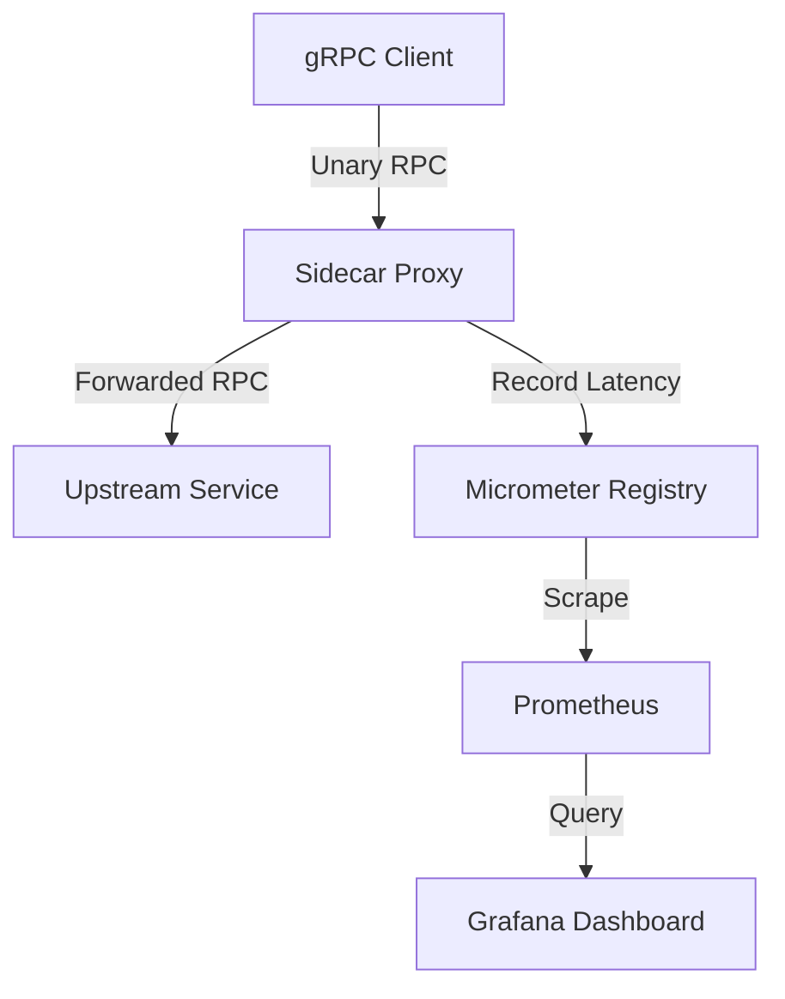

# Architecture

## Components
1. **ProxyCallHandler:** A generic `ServerCallHandler` that intercepts all `byte[]` streams.
2. **CardinalityController:** Ensures method labels do not cause a Prometheus cardinality explosion.
3. **MetricsServer:** Exposes `/metrics` for Prometheus and `/debug/obs` for human-readable latency snapshots using HdrHistogram.
